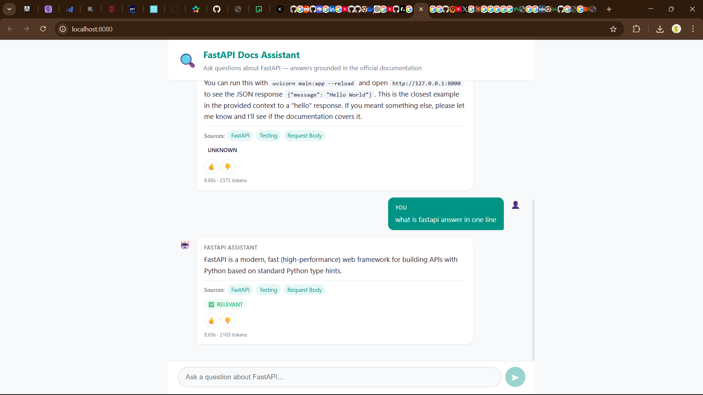
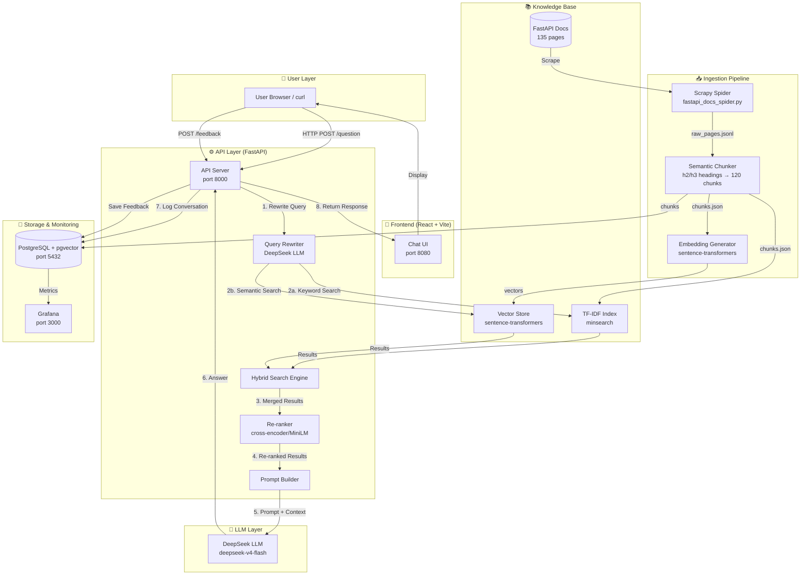

# FastAPI Docs Assistant

<p align="center">
  
  <br>
  <em>Chat interface: ask natural language questions about FastAPI and get precise, context-grounded answers with source citations.</em>
</p>

A Retrieval-Augmented Generation (RAG) application that answers questions about FastAPI documentation using DeepSeek LLM. Built as the capstone project for the [LLM Zoomcamp](https://github.com/DataTalksClub/llm-zoomcamp) course.

---

## Problem Statement

FastAPI is one of the most popular Python web frameworks, with official documentation spanning 135 pages across tutorials, advanced guides, and API reference. Developers face three challenges:
- **Beginners** feel overwhelmed navigating where to find specific patterns
- **Intermediate users** waste time searching across multiple pages
- **Experienced developers** need quick, precise lookups without re-reading entire pages

**FastAPI Docs Assistant** lets developers ask natural language questions and get precise, context-grounded answers from the official documentation with citations.

---

## Architecture



### Flow Description

#### Query Flow (Runtime)
1. **User submits** a question via the chat UI or direct API call (`POST /question`)
2. **Query rewriting** expands the user's query for better search coverage using DeepSeek LLM
3. **Hybrid search** retrieves relevant docs using both TF-IDF keyword search and vector semantic search simultaneously
4. **Cross-encoder re-ranker** re-orders the merged results by actual relevance (MiniLM model)
5. **Prompt builder** constructs a context-grounded prompt using the top-k re-ranked documents
6. **DeepSeek LLM** generates a natural language answer with source citations
7. **Conversation logging** saves the query, response, relevance scores, token usage, and cost to PostgreSQL
8. **Response returned** to the user via the chat interface

#### Feedback Flow
- Users can submit thumbs-up/down feedback on responses
- Feedback is stored alongside the conversation for quality monitoring

#### Ingestion Pipeline (Offline)
- Scrapy spider scrapes 135 FastAPI documentation pages into `raw_pages.jsonl`
- Semantic chunker splits pages at h2/h3 heading boundaries (generates ~120 chunks)
- TF-IDF index is built from chunks for keyword search
- Embedding generator creates vector embeddings for semantic search
- Everything is indexed and ready for querying

---

## Demo


*The FastAPI Docs Assistant in action. Users type natural language questions about FastAPI and receive context-grounded answers with code examples, source citations, and relevance scoring.*

---

## Technology Stack

| Component | Technology | Purpose |
|-----------|-----------|---------|
| Backend | FastAPI | Web API server |
| LLM | DeepSeek (deepseek-v4-flash) | Answer generation and query rewriting |
| Text Search | minsearch (TF-IDF) | Keyword-based retrieval |
| Vector Search | sentence-transformers | Semantic embedding search |
| Re-ranker | cross-encoder (MiniLM) | Result relevance re-ordering |
| Database | PostgreSQL 16 + pgvector | Conversation logging and vector storage |
| Monitoring | Grafana | Dashboards and analytics |
| Frontend | React + Vite | Chat user interface |
| Scraping | Scrapy | Documentation scraper |
| Containerization | Docker Compose | Service orchestration |

---

## Data

The dataset consists of 135 HTML pages scraped from FastAPI official docs using Scrapy, split into 120 unique semantic chunks via heading-based chunking.

| File | Contents |
|------|----------|
| `data/fastapi_docs/raw_pages.jsonl` | 135 raw HTML pages (Scrapy) |
| `data/fastapi_docs/chunks.json` | 120 semantic chunks by h2/h3 heading |
| `data/fastapi_docs/text_index.pkl` | TF-IDF search index |
| `data/ground-truth-retrieval.csv` | 268 Q&A pairs across 119 chunks |
| `data/retrieval-results.csv` | 4 search approaches evaluated |
| `data/rag-evaluation.csv` | 26 RAG evaluations (LLM-as-a-Judge) |
| `data/re-ranking-results.csv` | 2 approaches: hybrid vs hybrid+rerank |
| `data/query-rewriting-results.csv` | 2 approaches: with/without query rewrite |
| `data/best-params.json` | Optimized: alpha=0.1, boost tuned |

### Retrieval Evaluation Results

| Approach | Hit Rate | MRR |
|----------|:--------:|:---:|
| Text (TF-IDF default) | 0.5741 | 0.2909 |
| Text (TF-IDF optimized) | 0.5370 | 0.3780 |
| Vector-only (pgvector) | 0.9815 | 0.8255 |
| Hybrid (alpha=0.1) | 0.9815 | 0.8258 |

### Re-ranking Evaluation Results

The cross-encoder re-ranker (MiniLM) further improves retrieval quality:

| Approach | Hit Rate | MRR |
|----------|:--------:|:---:|
| Hybrid search (no re-ranking) | 0.9286 | 0.9048 |
| Hybrid search + cross-encoder rerank | **0.9524** | **0.9405** |

### Query Rewriting Evaluation Results

Using DeepSeek to rewrite user queries before search improves retrieval:

| Approach | Hit Rate | MRR |
|----------|:--------:|:---:|
| No query rewriting | 0.9500 | 0.9250 |
| With DeepSeek query rewriting | **0.9750** | **0.9625** |

### RAG Evaluation (LLM-as-a-Judge)

26 RAG responses were evaluated using LLM-as-a-Judge across two prompt styles (concise and detailed). All responses were classified as **RELEVANT**, confirming the system consistently retrieves and generates accurate answers backed by documentation.

| Metric | Value |
|--------|:-----:|
| Total evaluations | 26 |
| RELEVANT responses | 26/26 (100%) |
| Prompt styles tested | concise, detailed |
| Topics covered | CORS, dependencies, path/query params, request body, testing, middleware, error handling, OpenAPI, static files, sub-dependencies |

### Optimized Parameters

The best parameters found through random search (boosts) and grid search (alpha):

```json
{
  "boost": {
    "title": 4.8,
    "heading_path": 0.32,
    "content": 0.56,
    "section": 2.38
  },
  "alpha": 0.1,
  "num_results": 10
}
```

---

## Quick Start

### Prerequisites

- Docker and Docker Compose
- DeepSeek API key (get at [platform.deepseek.com](https://platform.deepseek.com))

### Setup

```bash
cp .env.example .env
# Edit .env: set DEEPSEEK_API_KEY=sk-your-key
docker compose up -d
```

### Access

| Service | URL |
|---------|-----|
| Chat UI | http://localhost:8080 |
| API | http://localhost:8000 |
| API Docs | http://localhost:8000/docs |
| Grafana | http://localhost:3000 (admin/admin) |

### Verify

```bash
curl http://localhost:8000/health
curl -X POST http://localhost:8000/question \
  -H "Content-Type: application/json" \
  -d '{"question": "How do I add CORS?"}'
```

---

## Project Structure

```
fastapi-docs-assistant/
├── app/                          # Python backend (API, RAG, search)
│   ├── __init__.py               # Module init, DB connection helper
│   ├── db.py                     # PostgreSQL + pgvector: save/load chunks, vector search, feedback, conversation logging
│   ├── ingest.py                 # Full ingestion pipeline: scrape → chunk → embed → index
│   ├── load_index.py             # Load pre-built TF-IDF index from pickle (standalone mode, no DB needed)
│   ├── minsearch.py              # Pure-Python TF-IDF search index with boost support
│   ├── rag.py                    # Core RAG pipeline: query rewrite → hybrid search → re-rank → LLM → evaluate
│   ├── re_ranker.py              # Cross-encoder re-ranker (ms-marco-MiniLM-L-6-v2) for result refinement
│   └── vector_store.py           # Sentence-transformer embedding model (all-MiniLM-L6-v2)
├── scrapers/                     # Scrapy spider project for documentation scraping
│   ├── run_scraper.py            # Entry point to run the spider
│   ├── verify_output.py          # Verify scraped output integrity
│   ├── scrapy.cfg                # Scrapy project configuration
│   └── scrapers/
│       ├── __init__.py
│       ├── items.py              # Scrapy item definitions (DocumentationPage)
│       ├── pipelines.py          # Pipeline: deduplication, JSON export
│       ├── settings.py           # Spider settings (concurrency, delays, output format)
│       └── spiders/
│           ├── __init__.py
│           └── fastapi_docs_spider.py  # Spider: scrapes 135 FastAPI doc pages
├── frontend/                     # React + Vite chat user interface
│   ├── index.html                # HTML entry point
│   ├── nginx.conf                # Nginx config for production deployment
│   ├── package.json              # Node dependencies
│   ├── vite.config.js            # Vite build configuration
│   └── src/
│       ├── main.jsx              # React entry point
│       ├── App.jsx               # Main chat component (question input, message display)
│       └── index.css             # Chat UI styles
├── data/                         # Pre-computed datasets (gitignored)
│   ├── best-params.json          # Optimal alpha + boost parameters for production
│   ├── ground-truth-retrieval.csv # 268 Q&A pairs for retrieval evaluation
│   ├── retrieval-results.csv     # Hit Rate & MRR for 4 search approaches
│   ├── re-ranking-results.csv    # Impact of cross-encoder re-ranking on retrieval
│   ├── query-rewriting-results.csv # Impact of DeepSeek query rewriting on retrieval
│   ├── rag-evaluation.csv        # 26 LLM-as-a-Judge evaluations with token usage & cost
│   └── fastapi_docs/             # Raw & processed documentation
│       ├── raw_pages.jsonl       # 135 scraped HTML pages
│       ├── chunks.json           # 120 semantic chunks by heading
│       └── text_index.pkl        # Pre-built TF-IDF index
├── notebooks/                    # Evaluation and ground truth generation scripts
│   ├── 01-generate-ground-truth.py  # Uses DeepSeek to generate Q&A pairs from chunks
│   ├── 02-retrieval-evaluation.py   # Full retrieval eval: text, vector, hybrid + param optimization
│   ├── 03-rag-evaluation.py         # RAG pipeline eval: LLM-as-a-Judge with 2 prompt styles
│   ├── 04-re-ranking-evaluation.py  # Re-ranking impact on retrieval metrics
│   └── 05-query-rewriting-evaluation.py # Query rewriting impact on retrieval metrics
├── grafana/                      # Grafana dashboard provisioning
│   ├── dashboard.json            # Pre-built analytics dashboard
│   ├── dashboard.yml             # Dashboard auto-provisioning config
│   ├── datasource.yml            # PostgreSQL datasource for Grafana
│   └── init.py                   # Grafana datasource initialization
├── Dockerfile.app                # Multi-stage Python build (API + RAG dependencies)
├── Dockerfile.frontend           # Multi-stage React build (Nginx)
├── docker-compose.yaml           # 4 services: API, frontend, postgres, grafana
├── pyproject.toml                # Python dependencies & project metadata
├── .env.example                  # Environment variable template
├── .gitignore                    # Git ignore rules
└── server.py                     # FastAPI application entry point (routes, middleware, startup)
```

### Key Components Explained

| File | Role |
|------|------|
| `app/rag.py` | Core RAG orchestration — query rewriting, hybrid search, re-ranking, prompt building, DeepSeek LLM calls, relevance evaluation, and cost calculation |
| `app/minsearch.py` | Pure-Python TF-IDF search engine with configurable field boosts (title, heading_path, content, section) |
| `app/db.py` | PostgreSQL interaction layer — stores chunks with embeddings, performs vector search via pgvector, logs conversations and feedback |
| `app/ingest.py` | End-to-end ingestion pipeline: scrapes FastAPI docs, creates semantic chunks, builds TF-IDF index, generates embeddings, and stores everything |
| `app/re_ranker.py` | Cross-encoder re-ranker using `ms-marco-MiniLM-L-6-v2` to improve result ordering by semantic relevance |
| `app/vector_store.py` | Embedding generator using `sentence-transformers/all-MiniLM-L6-v2` for semantic search capabilities |
| `server.py` | FastAPI application server — defines `/question`, `/feedback`, `/health` endpoints, CORS middleware, and request/response models |
| `frontend/src/App.jsx` | React chat component — handles user input, displays conversation history, renders code blocks and source citations |

---

## License

MIT